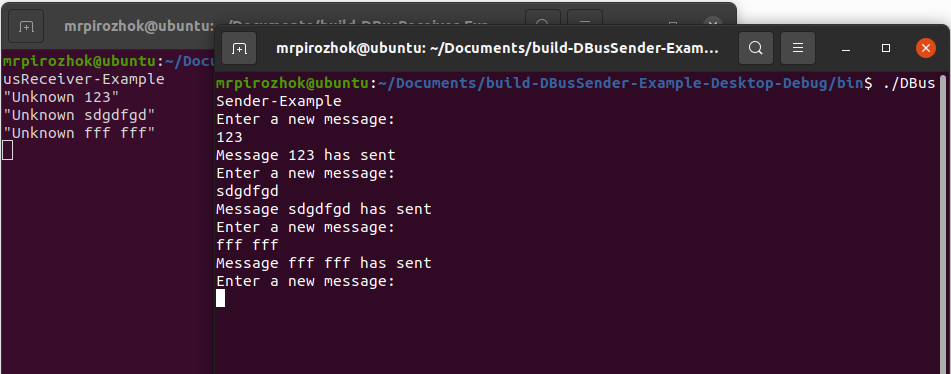

# QDBus-Example

## Описание

Пример использования QDBus для межпроцессного взаимодействия.



## Сборка проекта

Проект может быть собран из QtCreator или из папки build коммандами:

### CMake:

```bash
cmake ..
make
```
> Для debug - "cmake -DCMAKE_BUILD_TYPE=Debug ..", для release - "cmake -DCMAKE_BUILD_TYPE=Release .."

### QMake:

```bash
qmake ..
make
```
> Для debug - "qmake .. CONFIG+=debug", для release - "qmake .. CONFIG+=release"

## Запуск проекта

Интерфейс:
```bash
cd build
./QDBusReceiver-Example
```

Адаптер:
```bash
cd build
./QDBusSender-Example
```

## Версии

Версии сред, языков и утилит, которые использовались на момент написания проекта.

| Название   | Версия               |
| -----------|----------------------|
| C++        | 17                   |
| Qt         | 5.12.8               |
| CMake      | 3.16.3               |
| gcc        | 9.4.0                |

## Тестирование

- [ ] Windows
- [x] Linux (Ubuntu 20.04.1)
- [ ] Mac

> Для Windows необходимо доустановить dbus