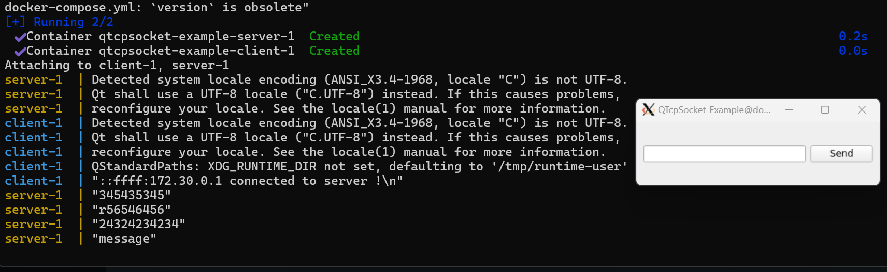

# QTcpSocket-Example

## Описание

Пример использования QTcpSocket и QTcpServer (клиент и сервер).

Пример работы с Docker-compose:


## Сборка проекта

В примере присутствуют два типа сборки - CMake и QMake.
Сборку можно производить из QtCreator или из папки build командами:

### CMake:

```bash
cmake ..
make
```
> Для debug - "cmake -DCMAKE_BUILD_TYPE=Debug ..", для release - "cmake -DCMAKE_BUILD_TYPE=Release .."

### QMake:

```bash
qmake ..
make
```
> Для debug - "qmake .. CONFIG+=debug", для release - "qmake .. CONFIG+=release"

## Сборка с помощью Docker-compose

Собрать (заменить your_ip_address на свой ip):
```bash
docker-compose build --build-arg IP_ADDRESS='your_ip_address'
```

Запустить:
```bash
docker-compose up
```

> Дополнительно потребуется VcXsrv Windows X Server для проброса экрана (см. Qt-CPP-Examples/Qt-External-Libraries-Examples/Docker-Example/README.md)

## Версии

Версии сред, языков и утилит, которые использовались на момент написания проекта.

| Название   | Версия               |
| -----------|----------------------|
| C++        | 20                   |
| Qt Creator | 11.0.2               |
| Qt         | 6.5.2                |
| CMake      | 3.24.2               |
| QMake      | 6.5.2.0              |
| MinGW      | 11.2 64 bit          |

Тестировалось на ОС Windows 11 22H2