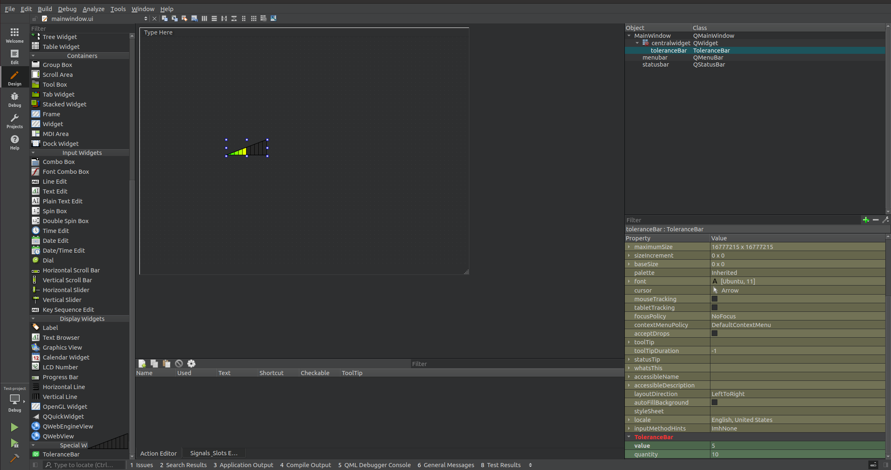

# QtUiPlugin-Example

## Описание

Пример использования QtUiPlugin для добавления новых виджетов в QtCreator.
В примере используется ToleranceBar ([Ссылка на исходники ToleranceBar](https://www.opendesktop.org/p/1132117 "ToleranceBar"))



## Сборка проекта

В примере присутствуют два типа сборки - CMake и QMake.
Для сборки необходимы инструменты qttools:

```bash
sudo apt-get install qttools5-dev
```

Сборку можно производить из QtCreator или из папки build коммандами:

### CMake:

```bash
cmake ..
sudo make install
```
> Для debug - "cmake -DCMAKE_BUILD_TYPE=Debug ..", для release - "cmake -DCMAKE_BUILD_TYPE=Release .."

### QMake:

```bash
qmake ..
sudo make install
```
> Для debug - "qmake .. CONFIG+=debug", для release - "qmake .. CONFIG+=release"

## Использование

1. После команды install библиотека будет добавлена в плагины qt: /usr/lib/x86_64-linux-gnu/qt5/plugins/designer/ (для x86). Это
необходимо, чтобы Qt Designer увидел виджеты и добавил в меню выбора. 

2. Заголовочные файлы будут добавлены в: /usr/include/x86_64-linux-gnu/qt5/QtUiPlugin (можно изменить на другое удобное место).

3. Для использования в другом проекте требуется добавить библиотеку и директорию с заголовочными в проект.

> Для удобства можно использовать CPack в Linux.
> Для автоматизации можно добавить файлы конфигурации с путями в CMake.
> Можно разделить библиотеку на две - с плагином и с виджетами, т.к. плагин не нужен для нового проекта, а только для Qt Designer.

## Версии

Версии сред, языков и утилит, которые использовались на момент написания проекта.

| Название   | Версия               |
| -----------|----------------------|
| C++        | 17                   |
| Qt         | 5.12.8               |
| CMake      | 3.16.3               |
| gcc        | 9.4.0                |

## Тестирование

- [ ] Windows
- [x] Linux (Ubuntu 20.04.1)
- [ ] Mac