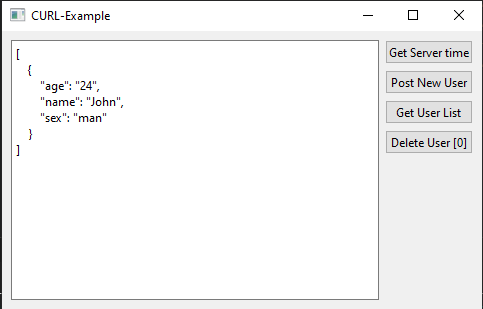

# CURL-Example

## Описание

Пример использования библиотеки libcurl для создание http клиента (get/post/delete запросы). В качестве сервера использовался пример Qt-Console-Examples/QHttpServer-Example.

[Ссылка на исходники Curl](https://github.com/curl/curl "Curl")



## Сборка проекта

1. Необходимо скачать и собрать библиотеку Curl.
2. Прописать пути к заголовочным файлам и файлам .ddl/.so в СMakeLists.txt (для CMake) или src/Source.pri (для QMake).
3. Собрать проект (cборку можно производить из QtCreator или из папки build коммандами):

### CMake:

```bash
cmake ..
make
```
> Для debug - "cmake -DCMAKE_BUILD_TYPE=Debug ..", для release - "cmake -DCMAKE_BUILD_TYPE=Release .."

### QMake:

```bash
qmake ..
make
```
> Для debug - "qmake .. CONFIG+=debug", для release - "qmake .. CONFIG+=release"

## Версии

Версии сред, языков и утилит, которые использовались на момент написания проекта.

| Название   | Версия               |
| -----------|----------------------|
| C++        | 20                   |
| Qt         | 6.4.0                |
| CMake      | 3.5                  |
| QMake      | 6.0.1 (6.0.0)        |
| MinGW      | 9.0.0 64 bit         |
| curl       | 8.1.5                |

## Тестирование

- [x] Windows (10, сборка 19044.2604)
- [ ] Linux
- [ ] Mac
