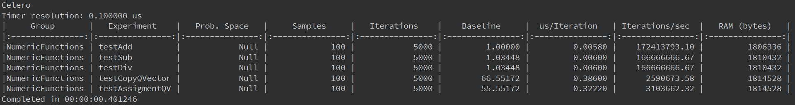

# Celero-Example

## Описание

Пример использования библитеки тестирования и измерения производительности кода Celero.

[Ссылка на исходники Celero](https://github.com/DigitalInBlue/Celero "Celero")



## Сборка

### CMake:

Собрать проект (cборку можно производить из QtCreator или из папки build коммандами):

```bash
cmake ..
make
```
> Для debug - "cmake -DCMAKE_BUILD_TYPE=Debug ..", для release - "cmake -DCMAKE_BUILD_TYPE=Release .."

## Версии

Версии сред, языков и утилит, которые использовались на момент написания проекта.

| Название   | Версия               |
| -----------|----------------------|
| C++        | 20                   |
| Qt Creator | 11.0.2               |
| Qt         | 6.5.2                |
| CMake      | 3.24.2               |
| MinGW      | 11.2 64 bit          |
| Celero     | 2.8.5                |

Тестировалось на ОС Windows 11 22H2