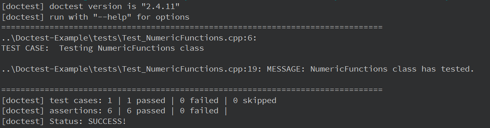

# Doctest-Example

## Описание

Пример использования однофайлового модуля тестирования Doctest.

[Ссылка на исходники Doctest](https://github.com/doctest/doctest "Doctest")



## Сборка

Собрать проект (cборку можно производить из QtCreator или из папки build командами):

### CMake:

```bash
cmake ..
make
```
> Для debug - "cmake -DCMAKE_BUILD_TYPE=Debug ..", для release - "cmake -DCMAKE_BUILD_TYPE=Release .."

### QMake:

```bash
qmake ..
make
```
> Для debug - "qmake .. CONFIG+=debug", для release - "qmake .. CONFIG+=release"
> Для приложения - "qmake .. CONFIG+=applicationConfig", для тестов - "qmake .. CONFIG+=testConfig"

> Файл doctest.h будет автоматически загружен с github.

## Версии

Версии сред, языков и утилит, которые использовались на момент написания проекта.

| Название   | Версия               |
| -----------|----------------------|
| C++        | 20                   |
| Qt Creator | 11.0.2               |
| Qt         | 6.5.2                |
| CMake      | 3.24.2               |
| QMake      | 6.5.2.0              |
| MinGW      | 11.2 64 bit          |
| Doctest    | 2.4.11               |

Тестировалось на ОС Windows 11 22H2