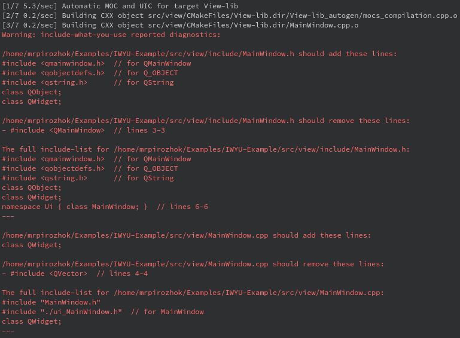

# IWYU-Example

## Описание

Пример использования утилиты include-what-you-use для поиска неиспользуемых заголовочных файлов.

[Ссылка на include-what-you-use](https://include-what-you-use.org/ "include-what-you-use")



## Сборка проекта

1. Скачать и установить include-what-you-use:
Для Linux:
```bash
sudo apt-get -y install iwyu
```
2. Собрать проект (cборку можно производить из QtCreator или из папки build коммандами):

### CMake:

```bash
cmake ..
make
```
> Для debug - "cmake -DCMAKE_BUILD_TYPE=Debug ..", для release - "cmake -DCMAKE_BUILD_TYPE=Release .."

## Версии

Версии сред, языков и утилит, которые использовались на момент написания проекта.

| Название   | Версия               |
| -----------|----------------------|
| C++        | 17                   |
| Qt         | 5.11                 |
| CMake      | 3.13                 |
| gcc        | 8.3.0                |

## Тестирование

- [ ] Windows
- [x] Linux (Debian 10 Buster)
- [ ] Mac
