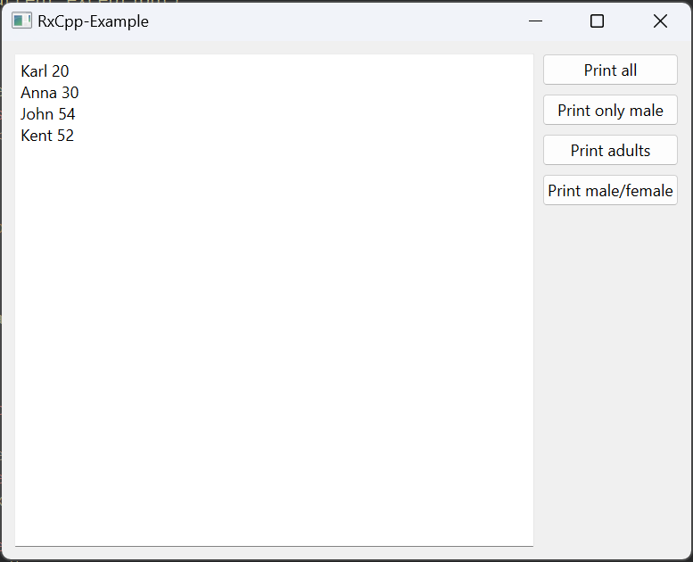

# RxCpp-Example

## Описание

Пример использования библитеки реактивных расширений RxCpp для стандартной библиотеки STL.

[Ссылка на исходники RxCpp](https://github.com/ReactiveX/RxCpp "RxCpp")



## Сборка

1. Скачать и установить RxCpp.
2. Указать пути в src/view/CMakeLists.txt или src/Source.pri.
3. Собрать проект.

### CMake:

Собрать проект (cборку можно производить из QtCreator или из папки build командами):

```bash
cmake ..
make
```
> Для debug - "cmake -DCMAKE_BUILD_TYPE=Debug ..", для release - "cmake -DCMAKE_BUILD_TYPE=Release .."

### QMake:

```bash
qmake ..
make
```
> Для debug - "qmake .. CONFIG+=debug", для release - "qmake .. CONFIG+=release"

## Версии

Версии сред, языков и утилит, которые использовались на момент написания проекта.

| Название   | Версия               |
| -----------|----------------------|
| C++        | 20                   |
| Qt Creator | 11.0.2               |
| Qt         | 6.5.2                |
| CMake      | 3.24.2               |
| MinGW      | 11.2 64 bit          |

Тестировалось на ОС Windows 11 22H2