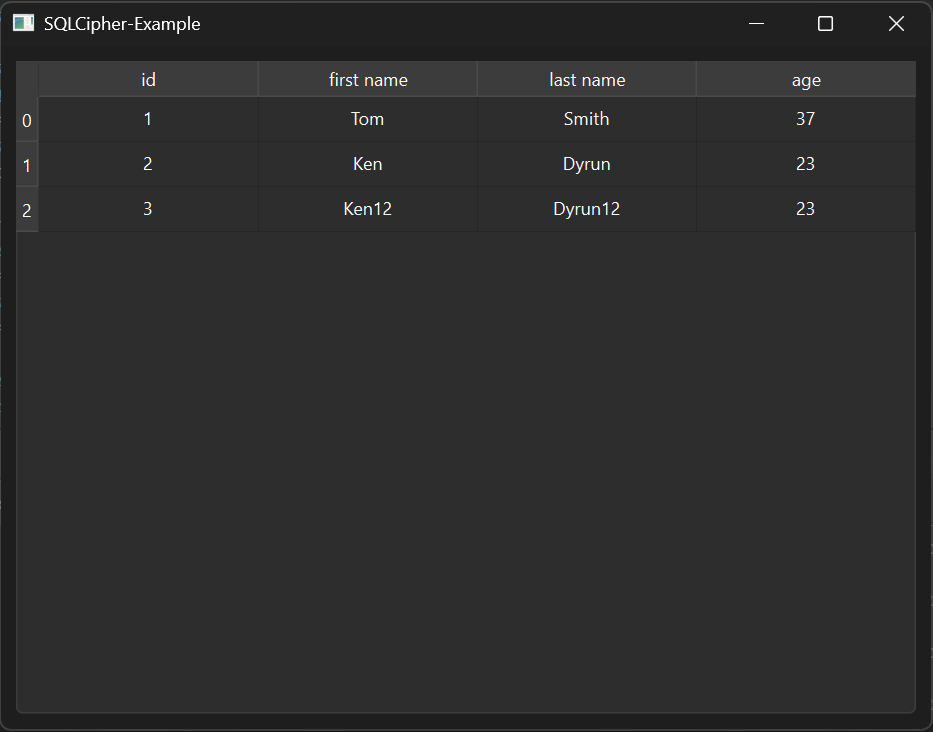

# SQLCipher-Example

## Описание

Пример использования библиотеки libsqlite3ms для взаимодействия с шифрованными базами данных SQLite/SQLCipher.



## Сборка проекта

1. Необходимо скачать и установить Conan ([Ссылка на пакетный менеджер Conan](https://conan.io/ "Conan")).
2. Создать профиль:

```bash
conan profile detect --force
```

3. Сгенерировать вручную (если нужно) CMake файлы для поиска библиотек в папку build:

```bash
conan install . --output-folder=build --build=missing
```

> Если библиотек нет на локальной машине, Conan скачает их из conan-center и соберёт

4. Собрать проект (cборку можно производить из QtCreator или из папки build командами):

```bash
cmake ..
make
```
> Для debug - "cmake -DCMAKE_BUILD_TYPE=Debug ..", для release - "cmake -DCMAKE_BUILD_TYPE=Release .."


4. Скрипт SQL (устанавливается в БД автоматически при первом запуске):

``` sql
CREATE TABLE IF NOT EXISTS "test.people" (
	id INTEGER PRIMARY KEY AUTOINCREMENT,
	first_name TEXT,
	last_name TEXT,
	age INTEGER
);

INSERT INTO test.people (first_name, last_name, age) VALUES ('Tom', 'Smith', 37);"
INSERT INTO test.people (first_name, last_name, age) VALUES ('Ken', 'Dyrun', 23);"
INSERT INTO test.people (first_name, last_name, age) VALUES ('Ken12', 'Dyrun12', 23);
```

4. Собрать проект (cборку можно производить из QtCreator или из папки build командами):

### CMake:

```bash
cmake ..
make
```
> Для debug - "cmake -DCMAKE_BUILD_TYPE=Debug ..", для release - "cmake -DCMAKE_BUILD_TYPE=Release .."

## Версии

Версии сред, языков и утилит, которые использовались на момент написания проекта.

| Название     | Версия               |
| -------------|----------------------|
| C++          | 20                   |
| Qt Creator   | 13.0.2               |
| Qt           | 6.6.3                |
| CMake        | 3.24.2               |
| Conan        | 2.0.11               |
| MinGW        | 11.2 64 bit          |
| libsqlite3mc | 2.1.0                |
| libsqlite    | 3.47.0               |

Тестировалось на ОС Windows 11 22H2

## Тестирование

- [x] Windows
- [ ] Linux (Ubuntu 22.04 LTS)
- [ ] Mac