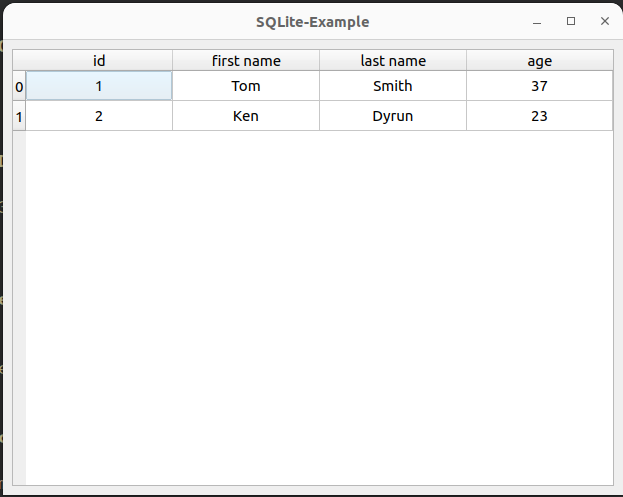

# SQLite-Example

## Описание

Пример использования библиотеки libsqlite3 для взаимодействия с базами данных SQLite.



## Сборка проекта

1. Скачать и установить SQLite:
``` bash
sudo apt-get install sqlite3 libsqlite3-dev sqlitebrowser
```
> sqlitebrowser - если нужно IDE для SQLite

2. Сгенерировать файл базы данных example.db:

``` bash
sqlite3
.open --new example.db
```

3. Создать таблицу:

``` sql
CREATE TABLE IF NOT EXISTS "test.people" (
	id INTEGER PRIMARY KEY AUTOINCREMENT,
	first_name TEXT,
	last_name TEXT,
	age INTEGER
);

INSERT INTO "test.people" (first_name, last_name, age) VALUES ('Tom', 'Smith', 37);
INSERT INTO "test.people" (first_name, last_name, age) VALUES ('Ken', 'Dyrun', 23);
```

4. Собрать проект (cборку можно производить из QtCreator или из папки build коммандами):

### CMake:

```bash
cmake ..
make
```
> Для debug - "cmake -DCMAKE_BUILD_TYPE=Debug ..", для release - "cmake -DCMAKE_BUILD_TYPE=Release .."

## Версии

Версии сред, языков и утилит, которые использовались на момент написания проекта.

| Название   | Версия               |
| -----------|----------------------|
| C++        | 17                   |
| Qt         | 5.15                 |
| CMake      | 3.23.2               |
| gcc        | 11.4.0               |

## Тестирование

- [ ] Windows
- [x] Linux (Ubuntu 22.04 LTS)
- [ ] Mac