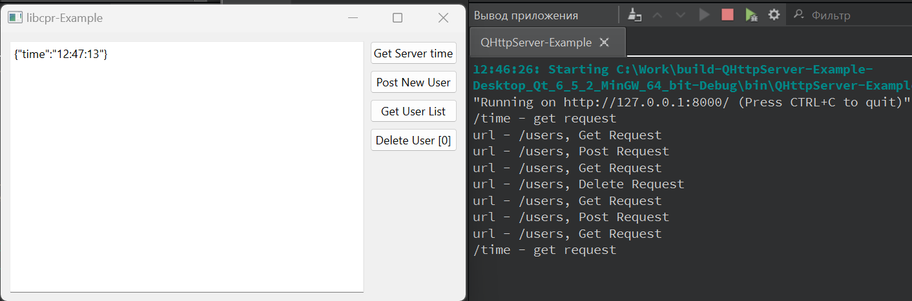

# libcpr-Example

## Описание

Пример использования библиотеки libcpr для создание http клиента (get/post/delete запросы). В качестве сервера использовался пример Qt-Console-Examples/QHttpServer-Example.

[Ссылка на исходники libcpr](https://github.com/libcpr/cpr "libcpr")



## Сборка проекта

1. Необходимо скачать и собрать библиотеку libcpr.
2. Прописать пути к заголовочным файлам и файлам .ddl/.so в СMakeLists.txt (для CMake) или src/Source.pri (для QMake).
3. Собрать проект (cборку можно производить из QtCreator или из папки build коммандами):

### CMake:

```bash
cmake ..
make
```
> Для debug - "cmake -DCMAKE_BUILD_TYPE=Debug ..", для release - "cmake -DCMAKE_BUILD_TYPE=Release .."

### QMake:

```bash
qmake ..
make
```
> Для debug - "qmake .. CONFIG+=debug", для release - "qmake .. CONFIG+=release"

## Версии

Версии сред, языков и утилит, которые использовались на момент написания проекта.

| Название   | Версия               |
| -----------|----------------------|
| C++        | 20                   |
| Qt Creator | 11.0.2               |
| Qt         | 6.5.2                |
| CMake      | 3.24.2               |
| QMake      | 6.5.2.0              |
| MinGW      | 11.2 64 bit          |
| Doctest    | 2.4.11               |

Тестировалось на ОС Windows 11 22H2

## Возможные проблемы

 - Библиотека нашла готовый CURL в системе - другой версии или собранный другим компилятором (например, от PostgreSQL).
 - Отличаются пути к libcpr в в СMakeLists.txt (для CMake) или src/Source.pri (для QMake).
 - Сборка libcpr завершилась ошибкой во время сборки (make install).
 - В сборке libcpr другой путь к CMAKE_INSTALL_PREFIX.
