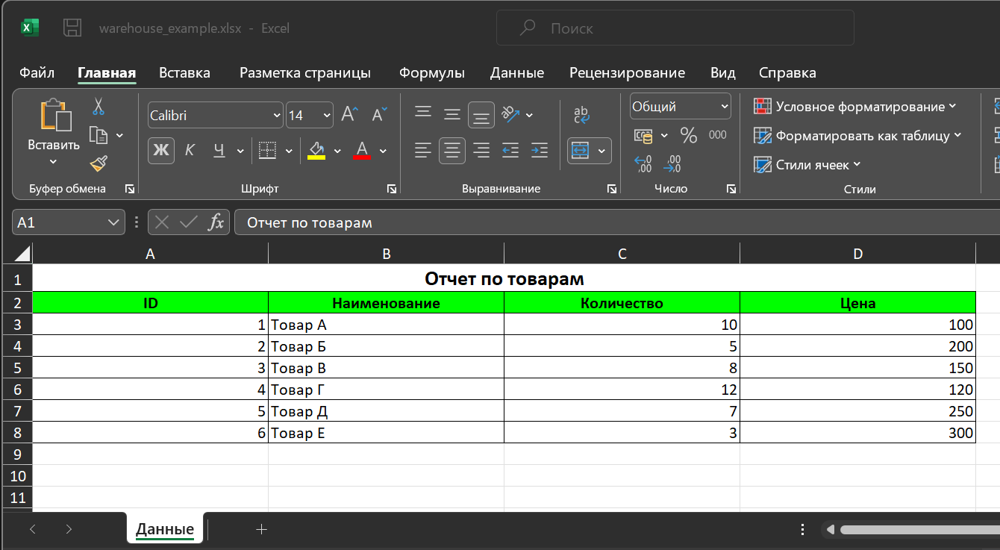

# libxlsxwriter-Example

## Описание

Пример использования библиотеки libxlsxwriter для создания excel таблиц.

[Ссылка на исходники libxlsxwriter](https://github.com/jmcnamara/libxlsxwriter "libxlsxwriter")



## Сборка проекта

1. Необходимо скачать и установить Conan.
2. Создать профиль:

```bash
conan profile detect --force
```

3. Сгенерировать CMake файлы для поиска библиотек в папку build:

```bash
conan install . --output-folder=build --build=missing
```

> Если библиотек нет на локальной машине, Conan скачает их из conan-center и соберёт

4. Собрать проект (cборку можно производить из QtCreator или из папки build командами):

```bash
cmake ..
make
```
> Для debug - "cmake -DCMAKE_BUILD_TYPE=Debug ..", для release - "cmake -DCMAKE_BUILD_TYPE=Release .."

## Версии

Версии сред, языков и утилит, которые использовались на момент написания проекта.

| Название      | Версия               |
| --------------|----------------------|
| C++           | 20                   |
| Qt Creator    | 13.0.2               |
| Qt            | 6.11.0               |
| CMake         | 3.24.2               |
| Conan         | 2.0.11               |
| MinGW         | 13.2 64 bit          |
| libxlsxwriter | 1.2.2                |

Тестировалось на ОС Windows 11 22H2
