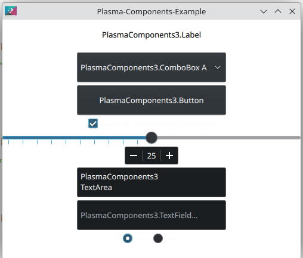

# Plasma-Components-Example

## Описание

Пример использования QML-компонентов в KDE Plasma.

## Сборка проекта

Проект необходимо собирать с помощью Qt или KDevelop с KDE-SDK.

## Версии

Версии сред, языков и утилит, которые использовались на момент написания проекта.

| Название   | Версия               |
| -----------|----------------------|
| C++        | 20                   |
| Qt Creator | 10.0.2               |
| Qt         | 6.4.2                |
| CMake      | 3.27.04              |
| KDevelop   | 5.12                 |

Тестировалось на ОС Kubuntu 23.10