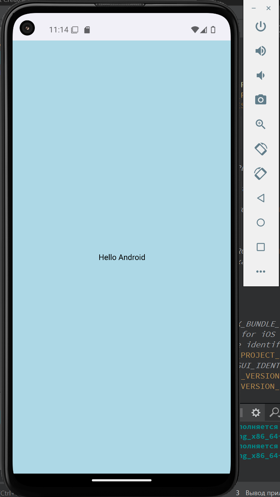

# QML-Android-Example

## Описание

Пример создания Android приложения на QML.

## Подготовка

1. Установить Qt и компоненты для Android разработки.
2. Установить Android Studio.
3. Установить виртуальное устройство в Android Studio и проверить работоспособность на пустом Java проекте.
4. В комплектах Qt добавить пути, установить OpenSSL и NDK.

 > Не все виртуальные устройства подходят, необходимо выбирать в соответствии с версией Qt. Так же более старые могут не работать.
 > Рекомендуется устанавливаться ПО в общую директорию, например: С:/Android/ и C:/Qt/

## Сборка проекта

Проект лучше всего собирать из QtCreator.

## Версии

Версии сред, языков и утилит, которые использовались на момент написания проекта.

| Название       | Версия                   |
| ---------------|--------------------------|
| C++            | 20                       |
| Qt             | 6.8.0                    |
| CMake          | 3.29.3                   |
| Clang          | x86_64, NDK 26.110909125 |
| Android Studio | Koala 2024.1.1           |

Тестировалось на ОС Windows 10 (сборка 19044.2604) + виртуальное устройство Pixel 4a API35