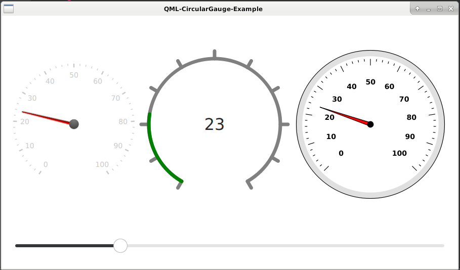

# QML-CircularGauge-Example

## Описание

Пример использования CircularGauge в QML:
- Стандартный из библиотеки QtQuick.Extras;
- Пользовательский на основе Canvas (QML).
- Пользовательский на основе QQuickPaintedItem (C++).



## Сборка проекта

1. Установить QtQuick.Extras:
```bash
sudo apt-get install libqt5x11extras5 libqt5x11extras5-dev
```
> Библиотека QtQuick.Extras есть только с Qt 5.5 до Qt 5.15.

2. Проект может быть собран из QtCreator или из папки build командами:

### CMake:

```bash
cmake ..
make
```
> Для debug - "cmake -DCMAKE_BUILD_TYPE=Debug ..", для release - "cmake -DCMAKE_BUILD_TYPE=Release .."

### QMake:

```bash
qmake ..
make
```
> Для debug - "qmake .. CONFIG+=debug", для release - "qmake .. CONFIG+=release"

## Версии

Версии сред, языков и утилит, которые использовались на момент написания проекта.

| Название   | Версия               |
| -----------|----------------------|
| C++        | 17                   |
| Qt         | 5.11                 |
| CMake      | 3.13                 |
| QMake      | 3.1                  |
| GCC        | 8.3.0                |

Тестировалось на ОС Debian 10 Buster (на ОС Windows 11 22H2 + Qt 6.5.2 без примера QtQuick.Extras)