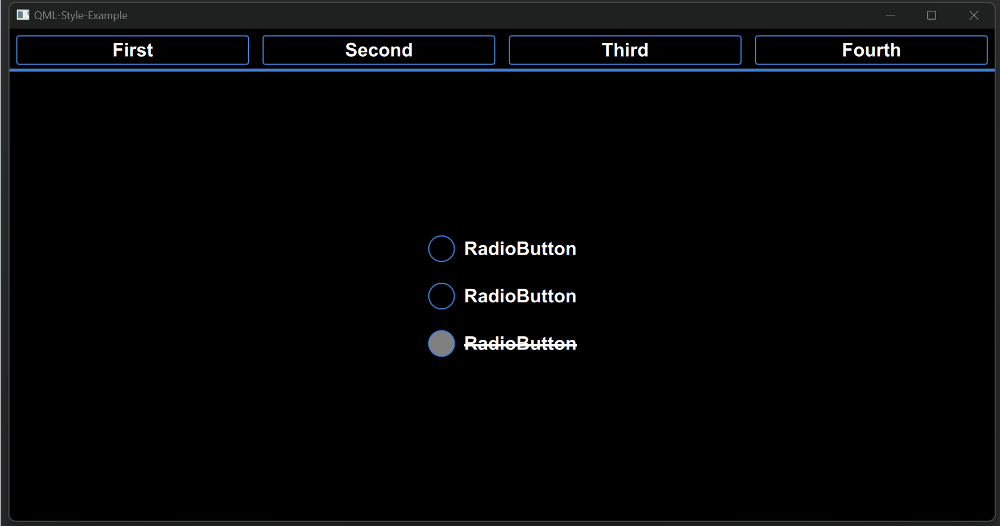

# QML-Style-Example

## Описание

Пример создания пользовательского стиля для компонентов QML:

- ApplicationWindow;
- CheckBox;
- ComboBox;
- GroupBox;
- Label;
- ProgressBar;
- RadioButton;
- RoundButton;
- ScrollBar;
- ScrollIndicator;
- Slider;
- SpinBox;
- Switch;
- TabBar;
- TabButton;
- TextArea;
- TextField;



## Сборка проекта

Проект может быть собран из QtCreator или из папки build коммандами:
CMake:

```
cmake ..
make
```

QMake:

```
qmake ../-project
qmake ..
make
```

## Версии

Версии сред, языков и утилит, которые использовались на момент написания проекта.

| Название   | Версия               |
| -----------|----------------------|
| C++        | 20                   |
| Qt         | 6.4.0                |
| CMake      | 3.5                  |
| QMake      | 6.0.1 (6.0.0)        |
| MinGW      | 9.0.0 64 bit         |

## Тестирование

- [x] Windows (10, сборка 19044.2604)
- [ ] Linux
- [ ] Mac