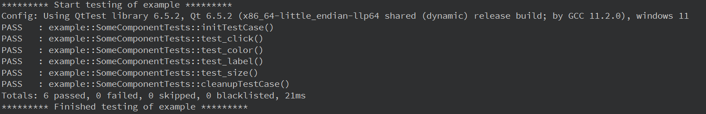

# QML-Test-Example

## Описание

Пример использования TestCase (QQuickTest) для тестирования qml-компонентов.



## Сборка проекта

1. Проект может быть собран из QtCreator или из папки build командами:

### CMake:

```bash
cmake ..
make
```
> Для debug - "cmake -DCMAKE_BUILD_TYPE=Debug ..", для release - "cmake -DCMAKE_BUILD_TYPE=Release .."

### QMake:

```bash
qmake ..
make
```
> Для debug - "qmake .. CONFIG+=debug", для release - "qmake .. CONFIG+=release"

2. Для тестов созданы подпроекты. Чтобы запустить тесты через консоль, необходимо воспользоваться утилитой qmltestrunner:
```bash
qmltestrunner -input tst_SomeComponent.qml
```

## Версии

Версии сред, языков и утилит, которые использовались на момент написания проекта.

| Название   | Версия               |
| -----------|----------------------|
| C++        | 20                   |
| Qt Creator | 11.0.2               |
| Qt         | 6.5.2                |
| CMake      | 3.24.2               |
| QMake      | 6.5.2.0              |
| MinGW      | 11.2 64 bit          |

Тестировалось на ОС Windows 11 22H2