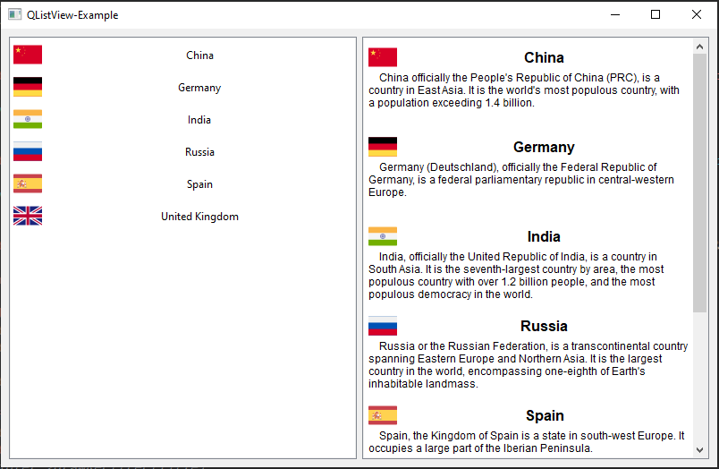

# QListView-Example

## Описание

Пример использования виджета QListView-Example со сложной моделью, а также с делегатом и без него.



## Сборка проекта

Проект может быть собран из QtCreator или из папки build коммандами:
CMake:

```
cmake ..
make
```

QMake:

```
qmake ../-project
qmake ..
make
```

## Версии

Версии сред, языков и утилит, которые использовались на момент написания проекта.

| Название   | Версия               |
| -----------|----------------------|
| C++        | 20                   |
| Qt         | 6.4.0                |
| CMake      | 3.5                  |
| QMake      | 6.0.1 (6.0.0)        |
| MinGW      | 9.0.0 64 bit         |

Тестировалось на ОС Windows 10 (сборка 19044.2604)

