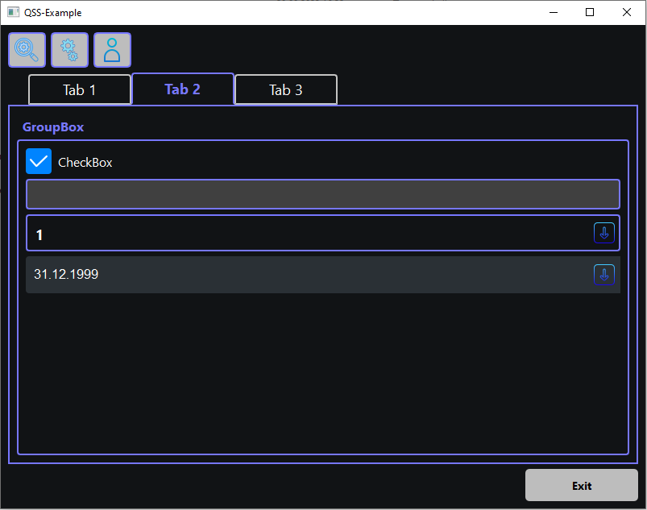

# QSS-Example

## Описание

Пример использования стилей CSS (QSS) для изменения внешнего вида виджетов:
 - QMainWindow;
 - QHeaderView;
 - QTableCornerButton;
 - QTableView;
 - QPushButton;
 - QCheckBox;
 - QToolButton;
 - QTabWidget;
 - QGroupBox;
 - QLineEdit;
 - QProgressBar;
 - QComboBox;
 - QFrame (HLine, VLine);
 - QScrollBar;
 - QMessageBox;
 - QDateEdit;
 - QCalendarWidget.



## Сборка проекта

Проект может быть собран из QtCreator или из папки build коммандами:

### CMake:

```bash
cmake -DCMAKE_BUILD_TYPE=type -G generator ..
cmake --build .
```
> type заменить на Debug, Release или другой
> generator заменить на Ninja, Unix Makefiles или другой

### QMake:

```bash
qmake CONFIG+=type ..
make
```
> type заменить на debug, release или другой

## Версии

Версии сред, языков и утилит, которые использовались на момент написания проекта.

| Название   | Версия               |
| -----------|----------------------|
| C++        | 20                   |
| Qt         | 6.4.0                |
| CMake      | 3.5                  |
| QMake      | 6.0.1 (6.0.0)        |
| MinGW      | 9.0.0 64 bit         |

Тестировалось на ОС Windows 10 (сборка 19044.2604)
