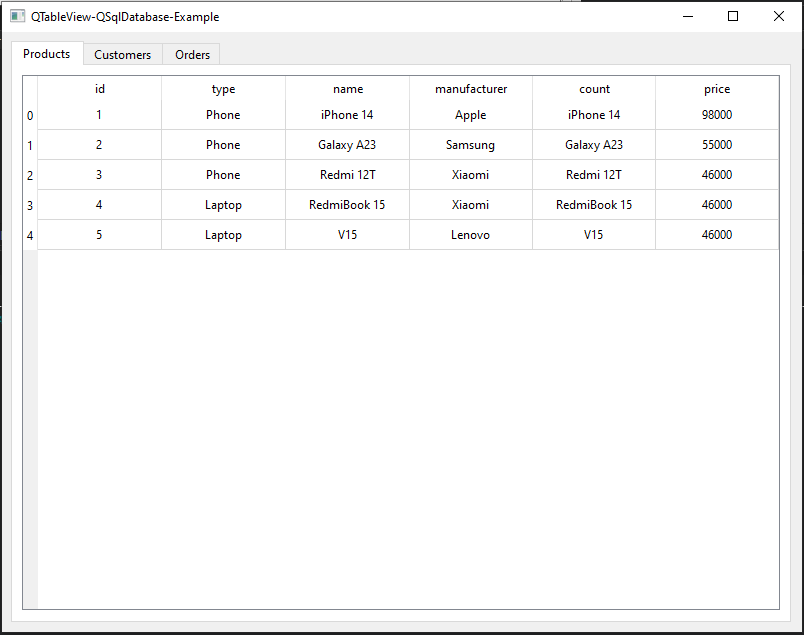

# QTableView-QSqlDatabase-Example

## Описание

Пример использования QSqlDatabase с выводом данных в QTableView.



## Сборка проекта

1. Скачать и установить PostgreSQL.
2. Сгенерировать базу данных (или doc/create_database.sql):

``` sql
CREATE DATABASE test_db;

CREATE TABLE IF NOT EXISTS Customers
(
    id         SERIAL PRIMARY KEY,
    first_name CHARACTER VARYING(30) NOT NULL,
    last_name  CHARACTER VARYING(30) NOT NULL,
    e_mail     CHARACTER VARYING(50) UNIQUE,
    age        INTEGER DEFAULT 18 CHECK(age > 0 AND age < 100)
);

CREATE TABLE IF NOT EXISTS Products
(
    id SERIAL PRIMARY KEY,
    product_type CHARACTER VARYING(30) NOT NULL,
    product_name CHARACTER VARYING(30) NOT NULL,
    manufacturer CHARACTER VARYING(30) NOT NULL,
    product_count INTEGER DEFAULT 0,
    price NUMERIC
);

CREATE TABLE IF NOT EXISTS Orders
(
    id SERIAL PRIMARY KEY,
    customer_id INTEGER,
    product_id  INTEGER,
    quantity INTEGER NOT NULL CHECK(quantity > 0),
    order_date DATE,
    order_time TIME,
    FOREIGN KEY (customer_id) REFERENCES Customers (id) ON DELETE RESTRICT,
    FOREIGN KEY (product_id) REFERENCES Products (id) ON DELETE RESTRICT
);

CREATE OR REPLACE RULE insert_products_notification
AS ON INSERT TO products DO SELECT pg_notify('insert_products_notification'::text, new.id::text) AS pg_notify;

CREATE OR REPLACE RULE delete_products_notification
AS ON DELETE TO products DO SELECT pg_notify('delete_products_notification'::text, old.id::text) AS pg_notify;

CREATE OR REPLACE RULE update_products_notification
AS ON UPDATE TO products DO SELECT pg_notify('update_products_notification'::text, new.id::text) AS pg_notify;

INSERT INTO Customers VALUES (default, 'Roy', 'Jones', 'roy_jones@gmail.com', 19);
INSERT INTO Customers VALUES (default, 'Philip', 'Morgan', 'philip_morgan@yandex.com', 24);
INSERT INTO Customers VALUES (default, 'Mary', 'Parker', 'mary_parker@free.com', 43);

INSERT INTO Products VALUES (default, 'Phone', 'iPhone 14', 'Apple', 3, 98000);
INSERT INTO Products VALUES (default, 'Phone', 'Galaxy A23', 'Samsung', 2, 55000);
INSERT INTO Products VALUES (default, 'Phone', 'Redmi 12T', 'Xiaomi', 7, 46000);
INSERT INTO Products VALUES (default, 'Laptop', 'RedmiBook 15', 'Xiaomi', 4, 46000);
INSERT INTO Products VALUES (default, 'Laptop', 'V15', 'Lenovo', 6, 46000);
INSERT INTO Products VALUES (default, 'Phone', 'iPhone 15', 'Apple', 5, 150000);

INSERT INTO Orders VALUES (default, 1, 1, 2, '2022-01-08', '12:21:34');
INSERT INTO Orders VALUES (default, 2, 3, 1, '2022-01-04', '10:41:54');
INSERT INTO Orders VALUES (default, 3, 5, 1, '2022-01-12', '16:09:12');
```
3. Собрать проект (cборку можно производить из QtCreator или из папки build коммандами):

### CMake:

```bash
cmake ..
make
```
> Для debug - "cmake -DCMAKE_BUILD_TYPE=Debug ..", для release - "cmake -DCMAKE_BUILD_TYPE=Release .."

### QMake:

```bash
qmake ..
make
```
> Для debug - "qmake .. CONFIG+=debug", для release - "qmake .. CONFIG+=release"

## Версии

Версии сред, языков и утилит, которые использовались на момент написания проекта.

| Название   | Версия               |
| -----------|----------------------|
| C++        | 20                   |
| Qt         | 6.4.0                |
| CMake      | 3.5                  |
| QMake      | 6.0.1 (6.0.0)        |
| MinGW      | 9.0.0 64 bit         |
| PostgreSQL | 9.4.10               |

## Тестирование

- [x] Windows (10, сборка 19044.2604)
- [ ] Linux
- [ ] Mac
