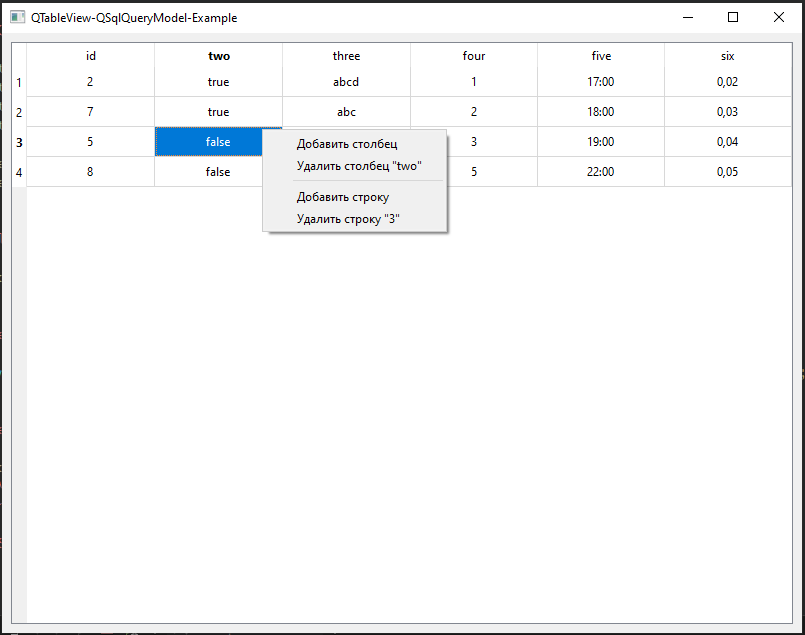

# QTableView-QSqlQueryModel-Example

## Описание

Пример использования QSqlQueryModel для отображении данных из БД в QTableView. 
По клику правой кнопки мыши выводится меню редактирования таблицы БД.
По двойному клику левой кнопки мыши редактируется значение ячейки.



## Сборка проекта

1. Скачать и установить PostgreSQL.
2. Сгенерировать базу данных (или doc/create_database.sql):

``` sql
CREATE DATABASE localtest;

CREATE TABLE test
(
    id serial NOT NULL,
    two boolean,
    three character varying(200),
    four integer,
    five time without time zone,
    six double precision
);
```

3. Собрать проект (cборку можно производить из QtCreator или из папки build коммандами):

Для CMake:

```
cmake ..
make
```

Для QMake:

```
qmake ../-project
qmake ..
make
```

## Версии

Версии сред, языков и утилит, которые использовались на момент написания проекта.

| Название   | Версия               |
| -----------|----------------------|
| C++        | 20                   |
| Qt         | 6.4.0                |
| CMake      | 3.5                  |
| QMake      | 6.0.1 (6.0.0)        |
| MinGW      | 9.0.0 64 bit         |

Тестировалось на ОС Windows 10 (сборка 19044.2604)

