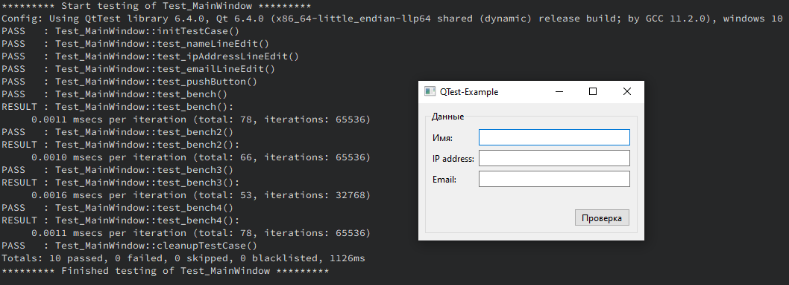

# QTest-Example

## Описание

Пример тестирования ui формы и других функций в Qt с использованием QTest.



Тесты запускаются перед открытием главного окна приложения. Так же можно вынести тесты в отдельный исполняемый файл, как в:
- Qt-External-Libraries-Examples/Boost-Example/Boost-Test-Example;
- Qt-External-Libraries-Examples/Celero-Example;
- Qt-External-Libraries-Examples/CppUTest-Example;
- Qt-External-Libraries-Examples/Doctest-Example;
- Qt-External-Libraries-Examples/GoogleTest-Example;

## Сборка проекта

Проект может быть собран из QtCreator или из папки build командами:
### CMake:

```bash
cmake ..
make
```
> Для debug - "cmake -DCMAKE_BUILD_TYPE=Debug ..", для release - "cmake -DCMAKE_BUILD_TYPE=Release .."

### QMake:

```bash
qmake ..
make
```
> Для debug - "qmake .. CONFIG+=debug", для release - "qmake .. CONFIG+=release"

## Версии

Версии сред, языков и утилит, которые использовались на момент написания проекта.

| Название   | Версия               |
| -----------|----------------------|
| C++        | 20                   |
| Qt         | 6.4.0                |
| CMake      | 3.5                  |
| QMake      | 6.0.1 (6.0.0)        |
| MinGW      | 9.0.0 64 bit         |

Тестировалось на ОС Windows 10 (сборка 19044.2604)