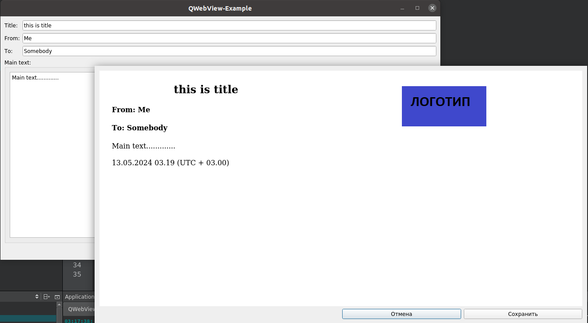

# QWebView-Example

## Описание

Пример использования QWebView для создания отчета в pdf с помощью html разметки.



## Сборка проекта

Проект может быть собран из QtCreator или из папки build командами:
### CMake:

```bash
cmake ..
make
```
> Для debug - "cmake -DCMAKE_BUILD_TYPE=Debug ..", для release - "cmake -DCMAKE_BUILD_TYPE=Release .."

### QMake:

```bash
qmake ..
make
```
> Для debug - "qmake .. CONFIG+=debug", для release - "qmake .. CONFIG+=release"

## Версии

Версии сред, языков и утилит, которые использовались на момент написания проекта.

| Название   | Версия               |
| -----------|----------------------|
| C++        | 20                   |
| Qt         | 5.12.8               |
| CMake      | 3.5                  |
| QMake      | 3.1.                 |
| gcc        | 9.4.0                |

Тестировалось на ОС Ubuntu 20.04