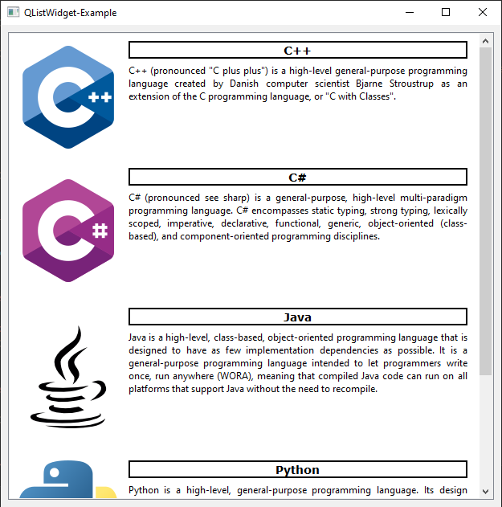
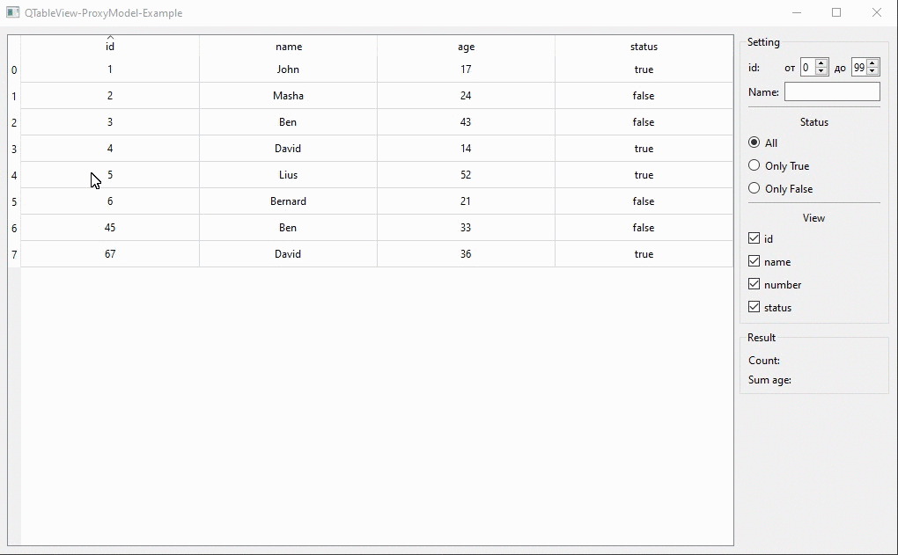
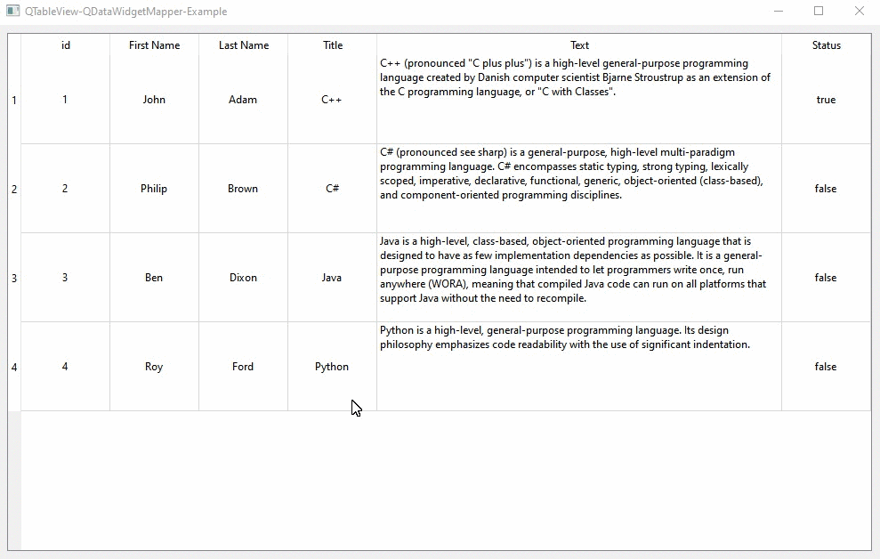

# Qt-Widgets-Examples

## QComboBox-Delegate-Example

Пример использование модели и делегата для QComboBox.

## QSettings-Example

Пример использование QSettings для сохранения настроек приложения на локальном компьютере.

## QListWidget-Example

Пример использования QListWidget с ui формой.

## QTableView-Delegates-Example

Пример использования делегатов для редактирования данных в ячейках QTableView.

## QTableView-ProxyModel-Example

Пример использования proxy model для фильтрации данных view model при отображении в QTableView.

## QTableView-QDataWidgetMapper-Example

Пример использования mapper для изменения данных в моделе таблицы QTableView.

## QTableView-QSqlQueryModel-Example

Пример использования QSqlQueryModel для отображении данных из БД в QTableView.

## QTest-Example

Пример тестирования ui формы и других функций в Qt.

